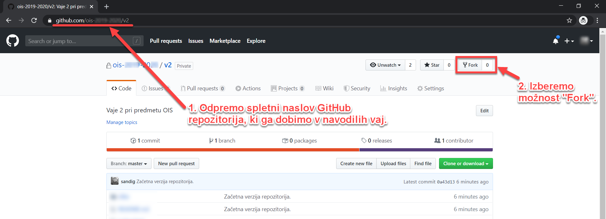
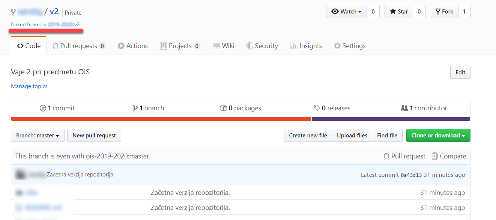
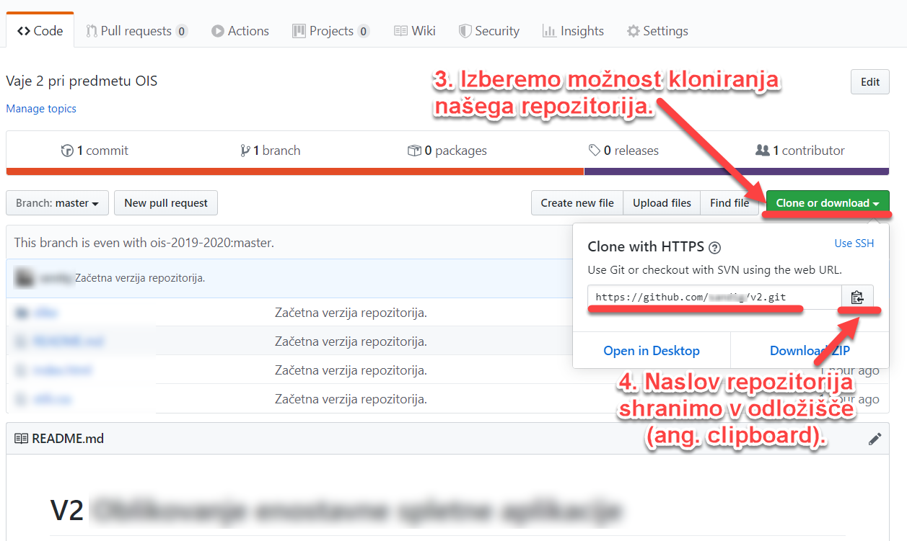
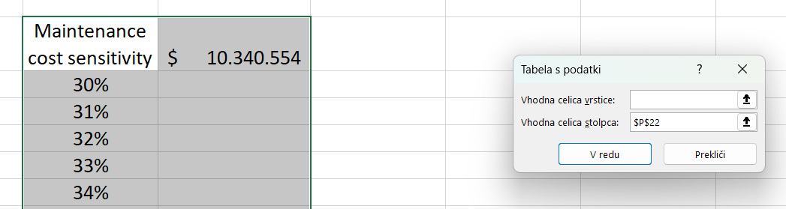

# **V2** Ocenjevanje stroškov programske opreme

Za lažje razumevanje vaj si poglejte priprave na vaje iz predavanj [**P2** Delovni model, arhitektura podjetja in vrednotenje naložb](https://teaching.lavbic.net/OIS/2022-2023/P2.html), odgovore na vprašanja iz teh vaj lahko posredujete v okviru lekcije **V2** na spletni učilnici.

## Vzpostavitev okolja

### Kreiranje kopije GitHub repozitorija

Izvorna koda vseh vaj (kasneje tudi domačih nalog) bo objavljena v oddaljenem Git repozitoriju sistema **Github**. Najprej obiščite spletno stran projekta [**V2**](https://github.com/OIS-2022-2023/V2) (glej **1. korak** na naslednji sliki ter zgoraj na desni strani izberite možnost `Fork` (glej **2. korak** na sledeči sliki.

   
  <i>Začetna stran GitHub repozitorija</i>

V primeru, da vaše uporabniško ime dostopa do več skupin, izberite vašo krovno skupino oz. vaše uporabniško ime kot je prikazano na naslednji sliki.

   
  <i>Izbirno modalno okno z vprašanjem v katero skupino izvedemo fork GitHub repozitorija</i>

Po uspešnem kreiranju lastne kopije repozitorija opazimo, da je kopija repozitorija enaka izvirniku, zgolj z razliko, da smo sedaj sami lastniki te kopije (ne več skupina _OIS-2022-2023_), kot prikazuje naslednja slika.

   
  <i>Lastna kopija GitHub repozitorija v2</i>

Če želimo začeti z delom na naši kopiji repozitorija, potem lahko izberemo možnost kloniranja našega repozitorija _(angl. Clone)_, kar prikazuje **3. korak** na naslednji sliki. Odpre se nam novo modalno okno, kjer je prikazan celoten naslov do našega repozitorija skupaj z git ukazom za kloniranje, ki ga lahko s klikom na gumb, ki je prikazan v **4. koraku** na naslednji sliki, shranimo v odložišče in uporabimo v naslednjem koraku kloniranja repozitorija v lokalnem okolju.

   
  <i>Pridobitev naslova za kloniranje repozitorija</i>

### Vzpostavitev delovnega okolja

Najpogostejši način vzpostavitve delovnega okolja je **kloniranje repozitorija** z ukazom `git clone <URL-repozitorija>` (npr. `git clone https://github.com/OIS-2022-2023/V2.git`), saj se v tem primeru samodejno kreira nova mapa, kjer se inicializira lokalni Git repozitorij in se vanj prenese vsebina oddaljenega GitHub repozitorija.

Če pa v svojem delovnem okolju že imamo **mapo** z določenimi podatki, ki bi jo zgolj želeli **povezati z oddaljenim repozitorijem**, potem lahko to naredimo z ukazi, ki smo jih spoznali v prejšnji vaji in so podrobneje opisani v naslednjem podpoglavju _Povezovanje oddaljenega repozitorija z obstoječo mapo_.

#### Kloniranje repozitorija

V tem GitHub repozitoriju najprej pridobimo URL naslov naše kopije (angl. fork) repozitorija kot je bilo pokazano v prejšnjih korakih. Če prilepimo ta URL naslov k osnovnemu ukazu, potem izvedemo naslednji ukaz (spremenljivko `{študent}` zamenjajte s svojim GitHub uporabniškim imenom):

* kloniranje repozitorija po **HTTPS protokolu**

    ~~~~ {.bash}
    git clone https://github.com/{študent}/V2.git
    ~~~~

* ali kloniranje repozitorija po **SSH protokolu**

    ~~~~ {.bash}
    git clone git@github.com:{študent}/V2.git
    ~~~~

#### Povezovanje oddaljenega repozitorija z obstoječo mapo

Če želimo lokalno mapo sami povezati z oddaljenim GitHub repozitorijem, potem je potrebno najprej **mapo kreirati** (če še ne obstaja) in se tudi **prestaviti v njo**.

~~~~ {.bash}
mkdir V2
cd V2
~~~~

Nato **inicializiramo lokalni repozitorij** v mapi, kjer se trenutno nahajamo.

~~~~ {.bash}
git init
~~~~

Sledi **dodajanje povezave `origin` na oddaljeni GitHub repozitorij**.

~~~~ {.bash}
git remote add origin https://github.com/{študent}/V2.git
~~~~

In na koncu še **pridobivanje vseh sprememb** veje razvoja `main` iz oddaljenega repozitorija, ki se nahaja na `origin` in prenos v lokalni repozitorij.

~~~~ {.bash}
git pull origin main
~~~~

> _Opomba_: Lokalne projektne nastavitve lokalnega razvojnega okolja WebStorm ne želimo uveljavljati zato imamo predpripravljeno datoteko `.gitignore` kjer vrstica `.idea` opredeljuje izjemo za uveljavitev mape `.idea` vključno z vsemi datotekami znotraj mape. Na takšen način vsebine mape .idea ne bo mogoče uveljavljati v oddaljenem repozitoriju ob na primer klicu git ukaza `git add .` (ukaz doda na seznam datotek za uveljavitev vse lokalne spremembe znotraj lokalnega okolja).

## Naloga

V tej nalogi se osredotočimo na analizo stroškov v IT domeni in sicer ocenjevanje stroškov programske opreme z uporabo aktualnih pristopov. Pri tem bomo za izhodišče uporabili primera iz predavanj, ki ju bomo ustrezno nadgradili.

### Primer ocene proračuna s pristopom od zgoraj navzdol s pristopom _"Kaj če"_ analize (angl. "What-If" Analysis)

V tej nalogi se bomo osredotočali na nadgradnjo analize čiste sedanje vrednosti (angl. Net Present Value (NPV)) predstavljene na predavanjih v poglavju [Primer ocene proračuna s pristopom od zgoraj navzdol](https://teaching.lavbic.net/OIS/2022-2023/P2.html#ocena-proracuna-s-pristopm-navzdol).

Nalogo bomo pripravili z nadgradnjo datoteke `AIMS, NPV - V2.xlsx` s pomočjo programa _Microsoft Excel_, ki omogoča **"Kaj če" analizo (angl. "What-If" Analysis)** [(primer)](https://www.excel-easy.com/data-analysis/what-if-analysis.html). Kot alternativo lahko uporabite brezplačni odportokodni _LibreOffice Calc_, ki omenjeno analizo omogoča v okviru funkcionalnosti **Iskanje cilja (angl. Goal Seek)** [(primer)](https://www.itcomputerguruji.com/2021/12/what-if-analysis-in-calc-goal-seek-in.html#:~:text=Goal%20seek%20is%20a%20what,use%20the%20Goal%20Seeks%20features.).

> Opomba: Spletna storitev _Google Sheets_ ne omogoča _"Kaj če" analizo_.

NVP uporabljamo za ocenjevanje finančnega učinka v nekem obdobju, v našem primeru 10-letnega izračuna poteka projekta na podlagi podanih predpostavk. Datoteko `AIMS, NPV - V2.xlsx` nadgradite tako, da pripravite analizo ter odgovorite na sledeča vprašanja pri čemer si lahko pomagate s predpripravljenimi osnutki tabel:

1. Pri katerem odstotku parametra _vzdrževanja / leto(%)_ bo vrednost NPV padla pod **10*106 USD**? Kolikšen bo NPV v primeru **37%** _vzdrževanja / leto_? 
   * Izvedba _"Kaj če" analize_ v Microsoft Excel je preprosta. Najprej označimo predpripravljeno tabelo vzdrževanj (30-100%) od celice **E30** do celice **F101**. Nato izvedemo _"Kaj če" analizo_: (zavihek) `Podatki` &rarr; `Analiza "kaj če"` &rarr; `Podatkovna tabela` (angl. `Data` &rarr; `What-if Analysis` &rarr; `Data Table`) in izberemo kot parameter `Vhodna celica stolpca` (angl. `Column input cell`) kot prikazuje primer na naslednji sliki.

   
  <i>Primer "Kaj če" analize na podlagi podatkovne tabele</i>

2. Zaradi povečanja tveganja recesije je potrebno izvesti dodatno _"Kaj če" analizo_ podobno kot v prejšnji nalogi. Tokrat analiza poteka na podlagi dveh spremenljivih parametrov in sicer **število posegov** (angl. procedures) ter **delež prihodkov operacijske sobe** (angl. OR Rev (% of total)) v tabeli od celice **H30** do **Q51**.
   * Na podlagi izvedene analize iz tabele razberite pri kateri stopnji deleža prihodkov dosežemo **izgubo** pri **717** bolnišničnih posegih?
   * Iz analze določite pri kolikšnem številu posegov dosežemo **izgubo** v primeru, ko je delež prihodkov ocenjen na **2%** ter koliko USD izguba znaša?

> _Namig_: Območje v tabeli _"Kaj če" analize_ izberite od celice `I31` do vključno `Q51`.

3. Koliko bi moralo biti **število operacijskih sob** (ang. operating rooms), da bi dosegli NPV 10-letnega obdobja vsaj **11*106 USD**? Rešitev podajte v celoštevilski obliki.
   * Pri izračunu si pomagajte s pristopom _Iskanje cilja_ (angl. Goal seek) pri _"Kaj če" analizi_, npr.:
     * Pri izbiri parametra `Vrednost celice` (angl. `Set cell`) določimo NPV, 
     * parameter `Nastavi na` (angl. `To value`) določimo na 11*106 USD v celoštevilski obliki in
     * parameter `S spreminjanjem celice` (angl. `By changing cell`) določimo spremenljiv parameter, ki je v našem primeru vrednost parametra število operacijskih sob.

> _Namig_: Pri pripravi ogrodja tabel je smiselno uporabiti funkcionalnost `Oblikuj celice` (angl. `Format cells`), da določimo pričakovano obliko izpisa celic (npr. določitev valute USD s simbolom $, izpis vrednosti z ali brez decimalnih mest idr.).

### Formalna metoda za ocenjevanje stroškov programske opreme

Za ocenjevanje stroškov programske opreme poznamo formalno metodo **točke primerov uporabe** (angl. _Use Case Points (**UCP**)_). Za izhodišče si bomo ogledali primer iz predavanj v podpoglavju [Formalna metoda za ocenjevanje stroškov programske opreme](https://teaching.lavbic.net/OIS/2022-2023/P2.html#UCP) in izvedli nove izračune na podlagi sprememb v specifikaciji sledečih korakov:

2. Akterja **skladiščnik** (angl. Warehouse Clerk) ter **skrbnik marketinga** (angl. Marketing Administrator) postaneta po klasifikaciji **povprečna** zaradi optimizacije njihovih poslovnih procesov predvsem zaradi avtomatizacije določenih opravil. Ponovno izračunajte **neprilagojeno utež akterjev (UAW)** na podlagi predstavljenih posodobitev.
3. Zaradi optimizacije opravil postanejo vsi primeri uporabe akterjev s prejšnjega koraka po klasifikaciji za eno stopnjo enostavnejša (npr. kompleksen &rarr; povprečen, povprečen &rarr; enostaven). Ponovno izračunajte **neprilagojeno utež primerov uporabe (UUCW)** na podlagi predstavljenih posodobitev.
4. Pri zasnovi sistema je prišlo do večje nadgradnje, saj si bodo lahko uporabniki sami nameščali sistem lokalno. Zato se je ocena faktorja tehnične kompleksnosti spremenila pri faktorjih:
   * **T1**, kjer se zmanjša stonja porazdeljenosti sistema in se dodeljena vrednost zmanjša na povprečno (**3**). Obenem se tudi utež zmanjša na vrednost **0.5**.
   * **T6**, kjer postane pomembna enostavnost namestitve in se zato poveča dodeljena vrednost na zelo pomembno (**5**) ter poveča vrednost uteži na **1.0**.
   
Za 4. korak je potrebno ponovno izračunati **TF** in nato še **faktor tehnične kompleksnosti (TCF)**. Ponovno je potrebno izračunati še preostale korake:

5. **točk primerov uporabe** (angl. Use-Case Points (**UCP**)),
6. **napor** (angl. effort) in
7. **strošek** (angl. cost). 

> _Namig_: Nalogo lahko rešujete tudi s pomočjo Microsoft Excel ali sorodnega programa.
